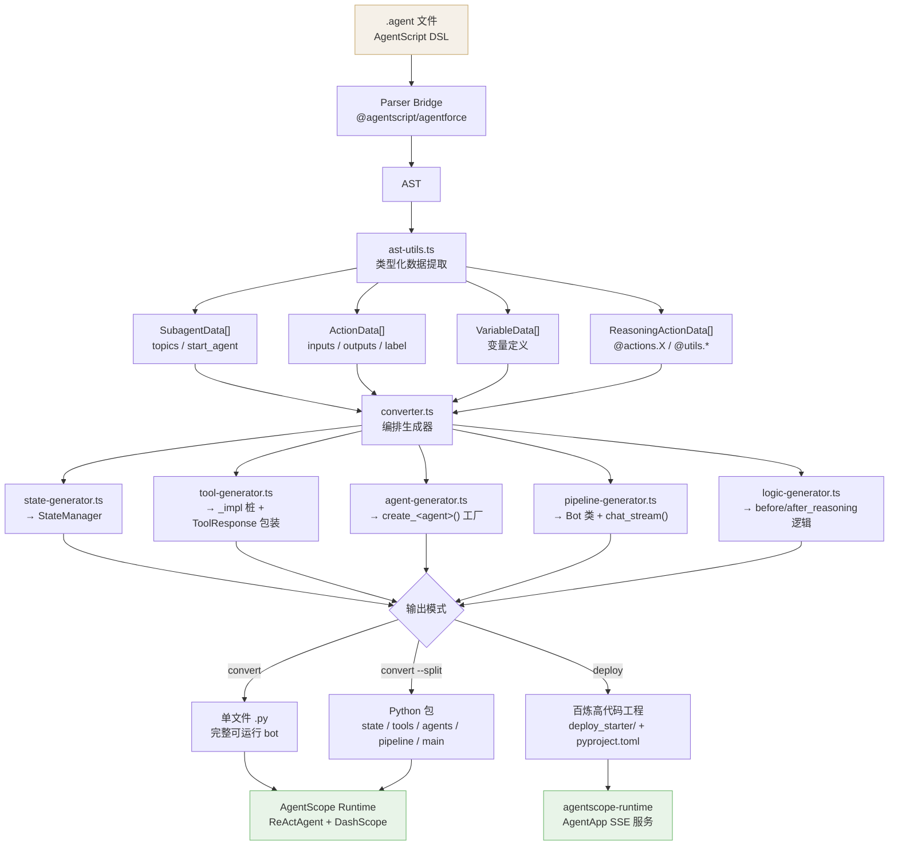

# AgentScript CLI — 能力概览

## 是什么

将 Salesforce AgentScript `.agent` 文件编译为可运行的 AgentScope Python 代码，并一键部署到阿里云百炼高代码平台。

---

## 构建流程



---

## 核心能力

### 1. 代码生成（`convert`）

从 `.agent` 文件生成完整的 Python bot：

| AgentScript 概念 | 生成产物 |
|---|---|
| `variables` | `StateManager` — 共享状态，贯穿整个对话 |
| `actions` | `_impl` 函数桩 + `ToolResponse` 包装器 |
| `reasoning.actions: @actions.X` | 命名异步 LLM tool，自动绑定状态参数 |
| `with x=@variables.Y` / `set @variables.X=@outputs.Y` | 调用时读写 state，不暴露给 LLM |
| `available when <condition>` | 运行时 guard，条件不满足返回 `{"skipped": true}` |
| `@utils.setVariables` | `_set_variables_<agent>` tool，带 Args docstring |
| `@utils.transition to @topic.X` | `_pending_transition` 驱动的 topic 跳转 |
| `@utils.escalate` | 人工接管桩（Omni-Channel 预留） |
| `before_reasoning` / `after_reasoning` | `*Wrapper` class，`before_call` / `after_call` 确定性逻辑 |

输出模式：
- **单文件**：`convert` → 一个 `.py`
- **包模式**：`convert --split` → `state.py / tools.py / agents.py / pipeline.py / main.py`
- **mock 模式**：`convert --mock` → 带随机假数据的可直接运行版本

### 2. Action 脚手架（`actions`）

```bash
npx tsx src/cli.ts actions examples/cxg_tech_support.agent
```

生成所有 action 的 `_impl` 函数桩（含类型注解和 docstring），供开发者填写业务逻辑后传入 bot。

### 3. E2E 测试生成（`gen-tests`）

四阶段流水线，从 `.agent` 自动生成 pytest 测试文件：

1. **AST 提取** — 解析 variables、actions、transition 规则
2. **DFS 路径枚举** — 遍历 topic 转移图，枚举所有可达 workflow 路径
3. **LLM 增强**（可选）— 调用 `qwen-plus` 为每条路径生成自然语言用户输入
4. **pytest 渲染** — 生成带 `make_impls()`、状态断言、inline 注释的完整测试文件

### 4. 百炼部署（`deploy`）

```bash
npx tsx src/cli.ts deploy examples/cxg_tech_support.agent \
  --actions examples/cxg_tech_support_actions.py
```

生成标准百炼高代码工程（Python wheel），包含：
- `SessionManager` — 按 session_id 隔离 bot 实例，支持 TTL 过期清理
- `AgentApp` + `@app.query("agentscope")` 入口
- 流式 SSE 输出，通过 `chat_stream()` 逐步推送进度

### 5. 流式进度推送（`chat_stream`）

生成的 bot 支持 `async for chunk in bot.chat_stream(text)` 接口，每次 action 调用或 topic 跳转前主动推送进度事件：

| SSE `metadata.kind` | 触发时机 | 示例文本 |
|---|---|---|
| `tool_call` | action 执行前 | `"Search Knowledge Base"` |
| `transition` | topic 跳转前 | `"Advanced Diagnosis..."` |
| `final` | agent 最终回复 | 正常对话文本 |

前端通过 `metadata.kind` 字段区分，可展示 tool call 进度条或 topic 切换动画。

---

## 示例 Agent

| 文件 | 描述 |
|---|---|
| `case_escalation_bot.agent` | 客服案例分级升级（4 topic） |
| `order_tracking_assistant.agent` | 订单追踪助手 |
| `cxg_tech_support.agent` | CXG Salesforce 技术支持（6 topic，含 MCP 集成） |
| `lead_qualification_bot.agent` | 销售线索资质评估 |
| `weather.agent` / `hello_world.agent` | 最小示例 |

---

## 技术栈

- **Parser**：`@agentscript/agentforce`（官方 Salesforce AgentScript 解析器）
- **Runtime**：AgentScope（ReActAgent + DashScope qwen3.6-flash）
- **Deploy**：`agentscope-runtime` + 阿里云百炼高代码平台
- **Actions**：支持 Salesforce MCP（`invoke_invocable_action` 调用 Salesforce custom actions）
- **Tests**：Vitest（40 个单元测试）+ pytest（e2e）
